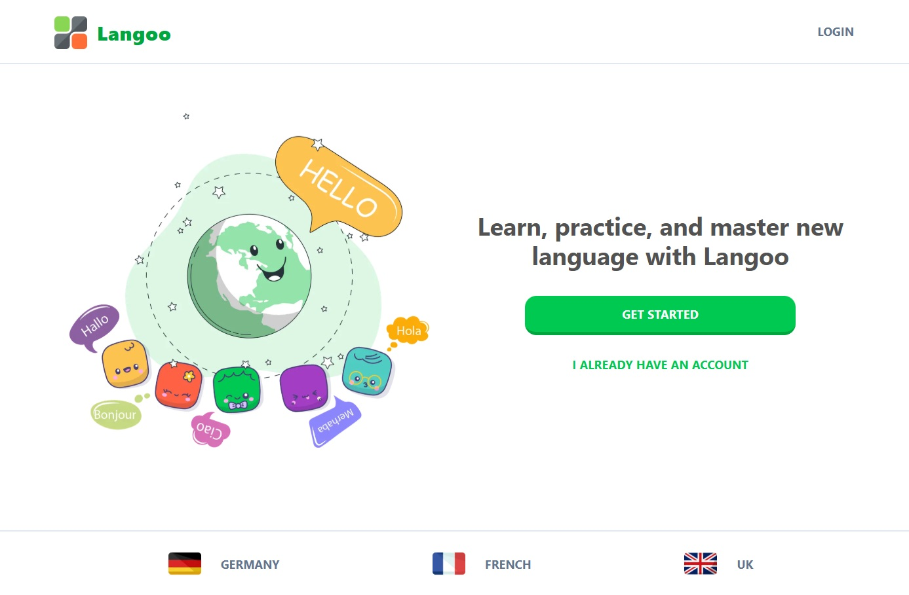

# 👩‍🎓 Language Learning App

A language learning web application inspired by Duolingo that helps users improve their language skills through interactive challenges and exercises.

## 👀 Live Demo

Check out the live app here: [https://language-app-delta.vercel.app/](https://language-app-delta.vercel.app/)

## 👍 Features

- User-friendly interface for learning new languages  
- Interactive challenges and quizzes  
- Subscription-based model for premium features  
- Audio and visual learning aids  
- Admin dashboard for managing content and users  
- Secure authentication and role-based access control  

## 👩‍💻 Technologies Used

- Next.js  
- TypeScript
- Clerk
- Stripe API for subscription payments  
- Drizzle ORM for database management  
- PostgreSQL database  
- Vercel for deployment

📧 Contact
l.kheiri66@gmail.com
